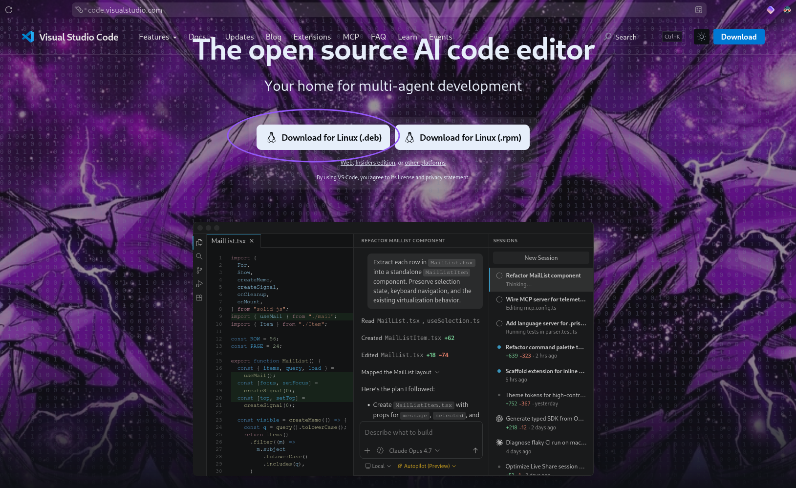
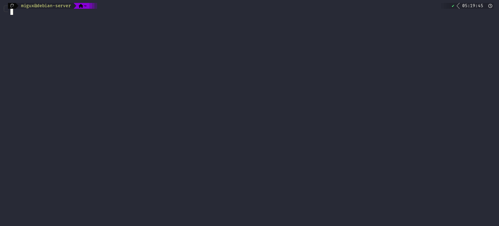
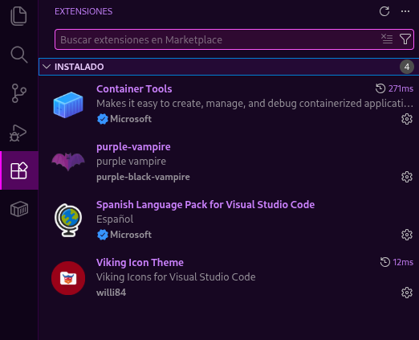
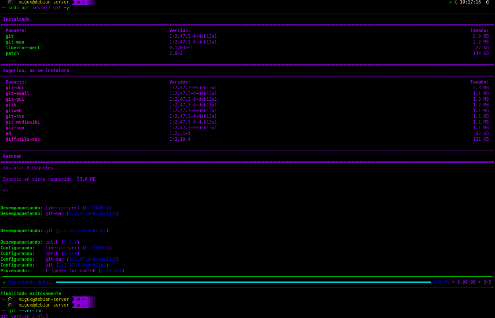
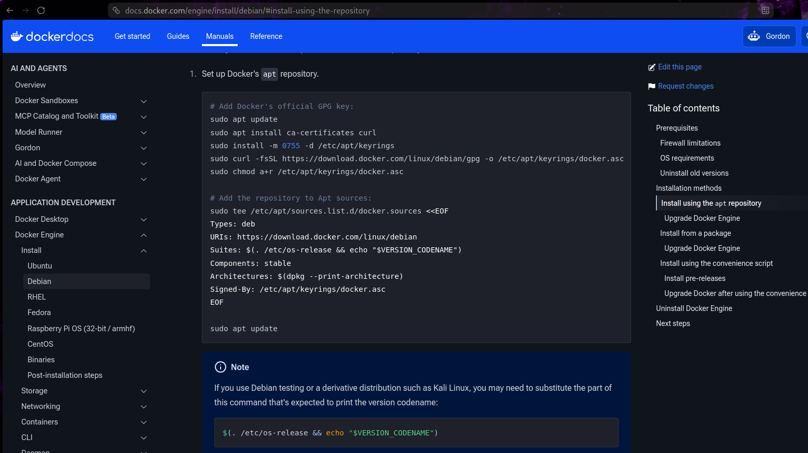
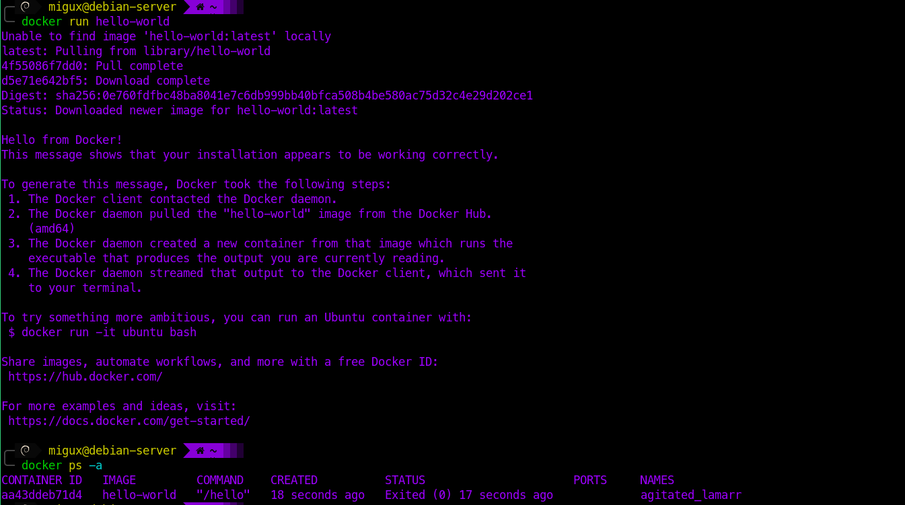
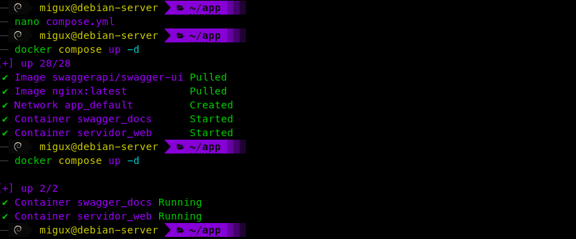
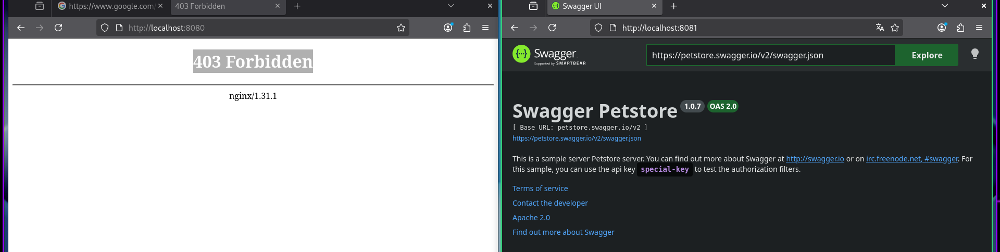

<div align="center">
  
</div>

# Instrumento de Evaluación Actividad 1

|  |  |
|---|---|
| **Alumno :** | Juan Miguel Hernández Beltrán |
| **No. Control:**| 1223100787 |
| **Grupo:** | GIRI6091-E |
| **Carrera:**| Ingeniería en Redes Inteligentes y Ciberseguridad |
| **Materia :** | Automatización de Infraestructura Digital |
| **Unidad 1 :** | Herramientas de automatización de redes |


---

## Tabla de contenido

- [Introducción](#introducción)
- [Desarrollo](#desarrollo)
  - [Descripción de herramientas](#descripción-de-herramientas)
    - [Docker Engine](#docker-engine)
    - [Docker Compose](#docker-compose)
    - [Docker Swagger (Swagger UI)](#docker-swagger--swagger-ui)
  - [Procedimiento de instalación](#procedimiento-de-instalación)
    - [VS Code y plugins](#1-visual-studio-code-y-plugins)
    - [Git](#2-git)
    - [Docker Engine](#3-docker-engine)
  - [Evidencia de pruebas](#evidencia-de-pruebas-de-verificación)
    - [Hello World / Verificación de Docker Engine](#hello-world--verificación-de-docker-engine)
    - [Archivo YML / Verificación de Docker Compose](#archivo-yml--verificación-de-docker-compose)
- [Conclusión](#conclusión)
- [Bibliografía](#bibliografía)

---

## Introducción

El presente reporte documenta el proceso de instalación y configuración de las herramientas de automatización de infraestructura digital trabajadas durante la primera unidad. El documento abarca tres aspectos principales: la descripción técnica de las herramientas utilizadas, el procedimiento de instalación paso a paso, y las pruebas que verifican el correcto funcionamiento del entorno configurado.
Las herramientas que se abordan son Docker Engine como motor de contenedores, Docker Compose para la orquestación de servicios mediante archivos de configuración, y Swagger UI para la documentación de APIs. Complementan el entorno VS Code como editor de código, sus extensiones correspondientes, y Git para el control de versiones del proyecto.
El problema que motiva el uso de estas herramientas es conocido en el desarrollo de software: un sistema que funciona en una máquina puede fallar en otra por diferencias en dependencias, versiones o configuraciones del sistema operativo. Los contenedores resuelven ese problema empaquetando la aplicación junto con todo lo que necesita para ejecutarse, garantizando un comportamiento consistente sin importar el entorno.
En el ámbito de redes y ciberseguridad este conocimiento es relevante porque los sistemas de monitoreo, análisis de tráfico y respuesta a incidentes se despliegan cada vez con mayor frecuencia como contenedores. Comprender cómo instalarlos, configurarlos y verificar su funcionamiento forma parte de las competencias básicas del ingeniero en redes inteligentes y ciberseguridad.

---

## Desarrollo

### Descripción de herramientas

#### Docker Engine

Docker Engine es el motor de contenedores del stack. Es un servicio que corre en segundo plano, el demonio `dockerd`, que recibe instrucciones vía API REST y las convierte en acciones sobre el sistema: crear imágenes, arrancar contenedores, administrar redes, gestionar volúmenes.

La arquitectura interna de Docker Engine está organizada en capas. Cada capa tiene una responsabilidad específica y se comunica solo con la capa inmediatamente siguiente:

```
Docker CLI  -->  dockerd (Docker Daemon)  -->  containerd  -->  runc  -->  Kernel Linux
```

- **Docker CLI**: el comando `docker` que escribe el usuario en la terminal. Envía peticiones JSON al demonio vía socket Unix (`/var/run/docker.sock`).
- **dockerd**: el demonio principal. Recibe las peticiones, toma decisiones de alto nivel y delega la ejecución a containerd.
- **containerd**: runtime estándar de la Cloud Native Computing Foundation (CNCF). Maneja el ciclo de vida de los contenedores y, desde Docker Engine v29, también el almacenamiento de imágenes.
- **runc**: implementación del estándar OCI (Open Container Initiative). Es quien llama directamente al kernel de Linux para crear los namespaces y cgroups que aíslan el contenedor.
- **Kernel Linux**: proporciona los mecanismos de aislamiento reales: namespaces (PID, red, sistema de archivos) y cgroups (límites de CPU y memoria).

Se instaló la versión v29.5.2 la mas actual. Lo relevante de esta versión es que usa `containerd` como almacén de imágenes por defecto, el mismo que usa Kubernetes. Esto elimina la duplicación entre el almacén antiguo de Docker y containerd.

| Componente | Rol | Espacio |
|---|---|---|
| `dockerd` | Orquestador principal | Usuario |
| `containerd` | Gestión de ciclo de vida e imágenes | Usuario |
| `containerd-shim` | Supervisor de proceso del contenedor | Usuario |
| `runc` | Creación de contenedores según OCI | Usuario → Kernel |
| Kernel Linux | Namespaces y cgroups (aislamiento real) | Kernel |

> Docker Engine es open source bajo licencia Apache 2.0. Para uso comercial en organizaciones de más de 250 empleados o ingresos superiores a 10 millones de dólares anuales, Docker Desktop requiere suscripción de pago.

---

#### Docker Compose

Docker Compose resuelve un problema que aparece en cuanto se trabaja con más de un contenedor: las aplicaciones reales rara vez son un solo servicio. Una aplicación web típica tiene servidor, base de datos, caché, documentación. Levantar cada contenedor por separado, recordar los puertos, las variables de entorno y el orden de arranque se vuelve complicado rápidamente.

Compose soluciona eso con un archivo YAML. Se escribe el estado deseado del sistema completo y con un solo comando se levanta todo:

```bash
docker compose up -d
```

La versión instalada implementa la **Compose Specification**, un estándar que desde 2021 unifica los formatos v2.x y v3.x. En Compose v2, el ejecutable es `docker compose` (subcomando de Docker) en lugar del `docker-compose` separado. La documentación oficial ya considera las versiones legacy como no mantenidas.

**Estructura de un archivo `compose.yaml`:**

```yaml
services:
  web:
    image: nginx:latest
    ports:
      - "8080:80"
    depends_on:
      - db

  db:
    image: postgres:15
    environment:
      POSTGRES_PASSWORD: ejemplo123
    volumes:
      - datos_db:/var/lib/postgresql/data

volumes:
  datos_db:
```

Compose gestiona automáticamente la red interna entre servicios. El servicio `web` puede conectarse al servicio `db` usando el nombre `db` como hostname, sin necesidad de conocer la IP del contenedor.

**Comandos principales de Docker Compose:**

```bash
docker compose up -d          # Levantar servicios en segundo plano
docker compose down           # Detener y eliminar contenedores y red
docker compose ps             # Estado actual de los servicios
docker compose logs -f        # Seguir logs en tiempo real
docker compose build          # Construir imágenes definidas en el archivo
docker compose config         # Validar el archivo compose.yaml
docker compose restart        # Reiniciar servicios sin eliminarlos
```

---

#### Docker Swagger / Swagger UI

Swagger es un conjunto de herramientas open source construidas sobre la **OpenAPI Specification (OAS)**. OpenAPI es el estándar para describir APIs REST; Swagger son las herramientas que lo implementan. El proyecto se donó a la OpenAPI Initiative en 2015. En la industria usan ambos términos como si fueran lo mismo.

OpenAPI define el formato (un archivo YAML o JSON con endpoints, parámetros, tipos de respuesta y autenticación). Swagger provee los editores, visualizadores y generadores de código que trabajan con ese formato.

Las herramientas principales del ecosistema son:

| Herramienta | Función |
|---|---|
| **Swagger Editor** | Editor en el navegador para escribir y validar definiciones OpenAPI |
| **Swagger UI** | Renderiza la especificación como documentación interactiva con formularios de prueba |
| **Swagger Codegen** | Genera stubs de servidor y SDKs de cliente desde una definición OAS |
| **Swagger Parser** | Librería para parsear y validar definiciones OAS en código |

En este entorno, Swagger UI corre como contenedor dentro del stack de Docker Compose. Cualquier miembro del equipo abre un navegador, explora los endpoints y los prueba sin escribir código. Para redes inteligentes y ciberseguridad, donde los servicios se comunican vía APIs, esto es útil al depurar o auditar un sistema.

```yaml
# Swagger UI como servicio en compose.yaml
services:
  swagger:
    image: swaggerapi/swagger-ui
    ports:
      - "8081:8080"
    environment:
      - SWAGGER_JSON_URL=https://petstore.swagger.io/v2/swagger.json
    restart: unless-stopped
```

> La versión actual del editor (SwaggerEditor@5, también llamado Swagger Editor Next) es la única que soporta OpenAPI 3.1.0. La versión anterior (SwaggerEditor@4) se considera legacy y no recibirá soporte para OAS 3.1.

---

### Procedimiento de instalación

#### 1. Visual Studio Code y plugins

VS Code es el editor que se usó como entorno de trabajo principal. Desde aquí se editaron los archivos `compose.yaml`, se ejecutaron comandos en la terminal integrada y se gestionaron los contenedores.

**Instalación:**

Se descargó el archivo `.deb` desde la página oficial de VS Code en el navegador.



```bash
sudo dpkg -i code_1.117.0-1776814346_amd64.deb
```

Durante la instalación apareció una pantalla para agregar el repositorio de Microsoft. Se seleccionó "Yes" y la instalación continuó.



**Extensiones instaladas:**

No todas son obligatorias, pero ayudan a trabajar más cómodo. Se instalaron las siguientes:

| Extensión | Tipo |
|-----------|------|
| Container Tools | Gestión de contenedores |
| Purple Vampire | Tema de color |
| Viking Icon Theme | Tema de iconos |
| Spanish Language Pack | Interfaz en español |



---

#### 2. Git

**Instalación:**

```bash
sudo apt update
sudo apt install git -y
```

**Verificar instalación:**

```bash
git --version
```



---

#### 3. Docker Engine

Primero se verificó el sistema para saber qué distribución usar. Docker muestra pasos específicos para Ubuntu, Debian, Fedora, CentOS y otras distribuciones.



Se siguieron los pasos para Debian:

**Paso 1.** Dependencias previas:

```bash
sudo apt update
sudo apt install -y ca-certificates curl
```

**Paso 2.** Agregar llave GPG oficial de Docker:

```bash
sudo install -m 0755 -d /etc/apt/keyrings
curl -fsSL https://download.docker.com/linux/debian/gpg \
  | sudo tee /etc/apt/keyrings/docker.asc > /dev/null
sudo chmod a+r /etc/apt/keyrings/docker.asc
```

**Paso 3.** Agregar repositorio de Docker:

```bash
echo "deb [arch=$(dpkg --print-architecture) signed-by=/etc/apt/keyrings/docker.asc] https://download.docker.com/linux/debian $(. /etc/os-release && echo "$VERSION_CODENAME") stable" | sudo tee /etc/apt/sources.list.d/docker.list > /dev/null
```

**Paso 4.** Instalar Docker:

```bash
sudo apt update
sudo apt install -y docker-ce docker-ce-cli containerd.io docker-buildx-plugin docker-compose-plugin
```

**Paso 5.** Agregar usuario al grupo docker (opcional, para no usar sudo):

```bash
sudo usermod -aG docker $USER
```

**Paso 6.** Habilitar e iniciar Docker:

```bash
sudo systemctl enable docker
sudo systemctl start docker
```

**Verificar instalación:**

```bash
docker --version
```


**Configuración adicional. Limitar logs:**

Para evitar que los logs de los contenedores llenen el disco, se configuró el límite de archivos:

```bash
nano /etc/docker/daemon.json
```

```json
{
  "log-driver": "json-file",
  "log-opts": {
    "max-size": "4m",
    "max-file": "3"
  }
}
```

---

### Evidencia de pruebas de verificación

#### Hello World / Verificación de Docker Engine

Se ejecutó la imagen `hello-world` para confirmar que Docker Engine funciona de extremo a extremo.

```bash
docker run hello-world
```



---

#### Archivo YML / Verificación de Docker Compose

Se creó un stack con dos servicios: Nginx como servidor web y Swagger UI para documentación de API. Se definieron en un solo archivo y se levantaron con un comando.

**Archivo `compose.yml`:**

```yaml
services:
  web:
    image: nginx:latest
    container_name: servidor_web
    ports:
      - "8080:80"
    volumes:
      - ./html:/usr/share/nginx/html
    restart: unless-stopped

  swagger:
    image: swaggerapi/swagger-ui
    container_name: swagger_docs
    ports:
      - "8081:8080"
    environment:
      - SWAGGER_JSON_URL=https://petstore.swagger.io/v2/swagger.json
    restart: unless-stopped
```

**Levantar el stack:**

```bash
docker compose up -d
```



**Verificar estado de los contenedores:**

```bash
docker compose ps
```

```
NAME             IMAGE                   STATUS         PORTS
servidor_web     nginx:latest            Up            0.0.0.0:8080->80/tcp
swagger_docs     swaggerapi/swagger-ui   Up            0.0.0.0:8081->8080/tcp
```

**Acceder a los servicios desde el navegador:**

| Servicio | URL | Descripción |
|---|---|---|
| Nginx | http://localhost:8080 | Servidor web en funcionamiento |
| Swagger UI | http://localhost:8081 | Documentación interactiva de API |



---

## Conclusión

**Juan Miguel Hernández Beltrán**

A lo largo de este reporte se abordaron tres herramientas centrales para la automatización de infraestructura digital: Docker Engine, Docker Compose y Swagger UI, complementadas por VS Code y Git como soporte del entorno de desarrollo.
El resultado principal es un entorno funcional, verificado mediante la ejecución de la imagen hello-world y el levantamiento de servicios con un archivo YAML. Ambas pruebas confirmaron que las herramientas quedaron correctamente instaladas y configuradas sobre Linux.
Entre los hallazgos más relevantes destaca la arquitectura en capas de Docker Engine. Al ejecutar un contenedor, el CLI contacta al demonio, este delega a containerd, containerd llama a runc, y runc solicita al kernel el aislamiento mediante namespaces y cgroups. Todo ocurre en fracciones de segundo de forma transparente para el usuario, lo que ilustra de manera concreta qué significa automatizar infraestructura.
Docker Compose demostró su utilidad al reducir la gestión de múltiples contenedores a un solo archivo de configuración versionable en Git. Esto elimina la necesidad de recordar puertos, variables de entorno y dependencias entre servicios cada vez que se levanta el entorno.
Swagger UI, por su parte, resultó relevante para el perfil de la carrera: al documentar y exponer los endpoints de una API desde un contenedor, facilita tanto la depuración como las auditorías de seguridad en entornos de redes inteligentes.
La base de conocimiento adquirida en esta unidad abre la puerta a aplicaciones concretas en ciberseguridad, como el despliegue de sistemas de monitoreo, análisis de tráfico o herramientas de detección de intrusos empaquetadas como contenedores.

---

## Bibliografía 

Docker, Inc. (2025). *Docker Engine overview*. Docker Documentation. https://docs.docker.com/engine/

Docker, Inc. (2025). *Docker Engine version 29 release notes*. Docker Documentation. https://docs.docker.com/engine/release-notes/29/

Docker, Inc. (2025). *Docker Compose overview*. Docker Documentation. https://docs.docker.com/compose/

Docker, Inc. (2025). *Compose file reference*. Docker Documentation. https://docs.docker.com/reference/compose-file/

Docker, Inc. (2025). *Docker Compose quickstart*. Docker Documentation. https://docs.docker.com/compose/gettingstarted/

Docker, Inc. (2025). *Install Docker Engine on debian*. Docker Documentation. https://docs.docker.com/engine/install/debian/

Docker, Inc. (2026). *Docker Engine version 29: A foundation release*. Docker Blog. https://www.docker.com/blog/docker-engine-version-29/

SmartBear Software. (2025). *What is OpenAPI?* Swagger Documentation. https://swagger.io/docs/specification/v3_0/about/

SmartBear Software. (2025). *Swagger Editor documentation*. Swagger Documentation. https://swagger.io/docs/open-source-tools/swagger-editor/

SmartBear Software. (2025). *Swagger UI: REST API documentation tool*. Swagger. https://swagger.io/tools/swagger-ui/

Microsoft. (2025). *Visual Studio Code: Frequently asked questions*. Visual Studio Code Documentation. https://code.visualstudio.com/docs/supporting/FAQ

Git Project. (2024). *Git reference documentation*. Git SCM. https://git-scm.com/docs/git

---
